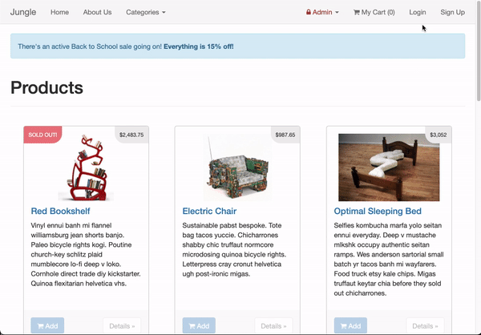

# Jungle

A mini e-commerce application built with Rails 4.2 that allows users to purchase goods and make payments through use of the Stripe API.

## Skills on Display

- [x] Ruby
- [x] Rails 4.2
- [x] ERB Templating
- [x] Stripe API
- [x] Active Record
- [x] PostgreSQL
- [x] RSpec
- [x] Capybara::Poltergeist

## Getting Started

1. Run `bundle install` to install dependencies
2. Create `config/database.yml` by copying `config/database.example.yml`
3. Create `config/secrets.yml` by copying `config/secrets.example.yml`
4. Run `bin/rake db:reset` to create, load and seed db
5. Create .env file based on .env.example
6. Sign up for a Stripe account
7. Put Stripe (test) keys into appropriate .env vars
8. Run `bin/rails s -b 0.0.0.0` to start the server

## Additional Steps for Apple M1 Machines

1. Make sure that you are runnning Ruby 2.6.6 (`ruby -v`)
1. Install ImageMagick `brew install imagemagick imagemagick@6 --build-from-source`
1. Remove Gemfile.lock
1. Replace Gemfile with version provided [here](https://gist.githubusercontent.com/FrancisBourgouin/831795ae12c4704687a0c2496d91a727/raw/ce8e2104f725f43e56650d404169c7b11c33a5c5/Gemfile)

## Stripe Testing

Use Credit Card # 4111 1111 1111 1111 for testing success scenarios.
More information in their [docs](https://stripe.com/docs/testing#cards)

## Dependencies & Dev Dependencies

- Ruby 2.3.5
- Rails 4.2 [Rails Guide](http://guides.rubyonrails.org/v4.2/)
- PostgreSQL 9.x
- Stripe
- sass-rails 5.x
- uglifier 1.3.0
- jquery-rails
- turbolinks
- jbuilder 2.x
- sdoc
- faker
- money-rails
- bcrypt 3.1.7
- bootstrap-sass 3.3.6
- font-awesome-rails
- money-rails
- carrierwave
- rmagick
- faker
- database_cleaner
